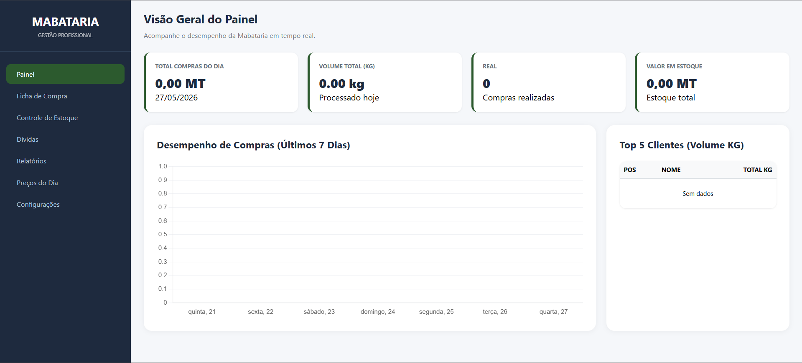

# Mabataria - Sucata 🏭

An offline desktop application for managing scrap metal purchasing businesses.
Built with Electron, HTML, CSS, JavaScript and SQLite.

> Developed and sold to a scrap metal business owner in Mozambique.

---

## Features

- 📦 **Stock Entry Registration** — Record all incoming scrap metal with details
- ⚖️ **Weight & Price Control** — Track weight and price per transaction
- 👥 **Supplier History** — Full history of all suppliers and their transactions
- 📊 **Profit Reports** — Generate reports to monitor business profitability
- 📈 **Daily Sales Dashboard** — Visual overview of daily purchasing activity
- 🏆 **Top 5 Supplier Ranking** — Highlights the best performing suppliers
- 🧾 **Purchase Receipt Printing** — Print receipts for every transaction

---

## Tech Stack

- [Electron](https://www.electronjs.org/) — Desktop application framework
- HTML5, CSS3, JavaScript — Frontend interface
- SQLite — Local offline database
- Node.js — Runtime environment

---

## Why Offline?

This system was designed for environments with limited or unreliable internet
connectivity, common in many parts of Mozambique and Africa.
All data is stored locally on the machine — no internet required.

---

## Screenshots

### Dashboard

---

## Author

**Bruno Dias Sabão**
Statistics & Information Management Student
Maputo, Mozambique

brunodiassabao@gmail.com